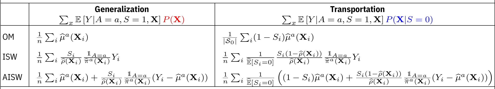

# `causalTransportR` : a package for bridging causal effects to new or general populations

`causalTransportR` implements a number of estimators to generalize and
transport causal effects by reweighting doubly-robust score functions
with transformations of selection scores. All nuisance functions are
cross-fit using fast supervised learning algorithms.

## Estimators

The `ateGT` function implements the following estimators by
aggregating estimates of individual marginal means over different
marginal $X$ distributions for the generalization and transportation
case. $\mu, \pi, \rho$ are nuisance parameters fit using ML.




## Installation

```
# install.packages("remotes") # if remotes isn't installed
remotes::install_github("Netflix-Skunkworks/causalTransportR")
```


## Reference

[Lal, Apoorva, Wenjing Zheng, Simon Ejdemyr, "A Framework for
Generalization and Transportation of Causal Estimates under Covariate
Shift", 2022](https://apoorvalal.github.io/files/papers/causalTransport.pdf)
